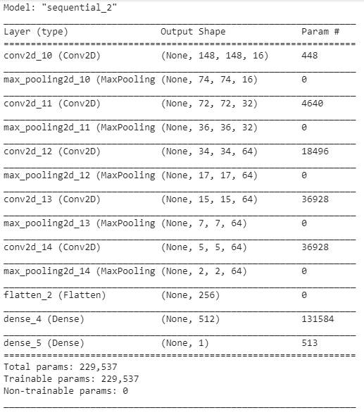
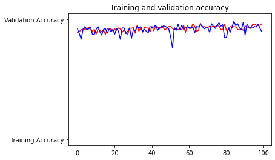
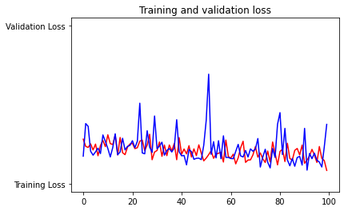

# Face-mask-classification-with-tensorflow

This project aims to detect whether or not a person is wearing a face mask.The image input which you give to the system will be analyzed
and the predicted result will be given as output.

## Conceptual Framework:
The project is entirely implemented using Python3.

The Conceptual Framework involved is mainly:
Keras – Tensorflow backend

## Model
I have built a model consisting of 5 convolutions and 5 max pooling layers, with ReLU as the activation function.

```python
model.summary()
```


## Accuracy
I achieved the training accuracy of 96.47%.




Find the code here:
https://github.com/DivyaMunot/Face-mask-detection-with-tensorflow/blob/master/face_mask_detect.py
